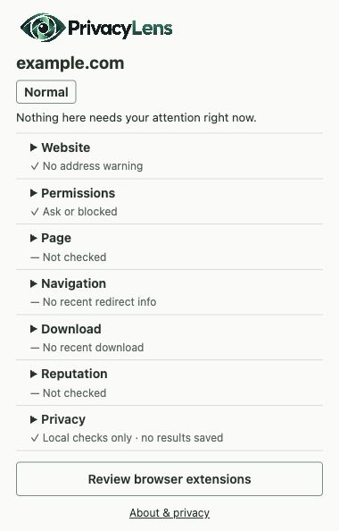

# PrivacyLens


**Understand what websites and browser extensions can access before you trust them.**

PrivacyLens is a student-built Chromium extension that explains what a site or extension can access and highlights things worth checking. Most checks stay in your browser. It does not keep browsing history.



## What it does

- Checks the current address for explainable domain and URL patterns.
- Shows the site's camera, microphone, location and other browser settings.
- Explains installed extensions' permissions in a separate, read-only audit.
- Scans forms and links only when you click **Scan this page**. Form values are never read.
- Explains Chrome's recent download warnings and unusual filename patterns, without reading files.
- Shows recent redirects Chrome reports for the current tab, without inventing a redirect chain.
- Offers an optional VirusTotal **hostname** lookup after your confirmation.

**Normal**, **Review** and **High Attention** are guidance, not verdicts. There are no percentage scores. Expand any finding to see what was noticed, why it matters and what to consider.

## Privacy by design

**See → Understand → Decide → Forget.**

No account, backend, analytics or scan-history database. Popup results disappear when it closes. The extension audit disappears when its page closes. One download or navigation record can remain briefly in memory, for at most five minutes and often less.

The only optional external check is VirusTotal. It receives the selected hostname and your API key after confirmation. Only a key you choose to remember is saved to disk; scan results are never saved. Anonymous request counters and the default session key stay in browser-session memory.

See the [data boundaries](docs/privacy.md) or open **About & privacy** in the extension for the full explanation, including Chrome's broader permission capabilities.

## How it works

Plain JavaScript, HTML and CSS, using Manifest V3. No framework, CDN, server or build step.

Browser readers collect a small set of allowed fields. Local analyzers apply deterministic rules and bundled domain lists. Views turn the results into short summaries and expandable explanations. The event-driven background process holds temporary download/navigation records and handles confirmed reputation lookups.

```text
src/analysis/       URL rules and conservative status labels
src/permissions/   Site-setting reads and explanations
src/page/          One-click structural page scan
src/extensions/    Read-only installed-extension audit
src/downloads/     Temporary download metadata checks
src/navigation/    Current-tab redirect awareness
src/reputation/    Opt-in VirusTotal, key and quota handling
src/popup/         Current-site view
src/options/       Optional key settings
src/transparency/  Permission and data disclosures
src/ui/            Shared text-only presentation
assets/            Logo and extension icons
data/              Bundled brand and shortener lists
tests/             Offline tests with mocked browser APIs
docs/              Rules, privacy, testing and validation notes
```

The overall popup status combines the address, site settings, navigation and any requested reputation report. Page scans, downloads and installed extensions keep separate labels. [Detailed rules](docs/rules.md) explain the combinations.

## Permissions

| Permission | Used for |
| --- | --- |
| `activeTab` | Read the chosen tab's address and temporarily access its page after your action. |
| `contentSettings` | Read six effective site settings; never change them. |
| `management` | Read installed-extension permissions and Chrome warnings; never disable or uninstall anything. |
| `scripting` | Run one read-only page scan after a click. |
| `downloads` | Observe new/changed download metadata; never open, delete, cancel or read files. |
| `webNavigation` | Read recent top-level navigation information for the focused active regular tab. |
| `storage` | Keep the optional key and anonymous session quota counters; never save scan results. |
| Optional `https://www.virustotal.com/*` | Retrieve an existing domain report after confirmation. |

No persistent access to the sites you browse is requested. There is no `history`, `tabs`, `cookies`, `webRequest` or `<all_urls>` permission. Chrome's APIs grant some broader abilities than PrivacyLens uses; see the bundled transparency page and [platform limits](docs/platform-limits.md).

## VirusTotal

Optional. PrivacyLens works without a key. In **VirusTotal settings**, enter your own fresh key. Leave **Remember on this browser** unchecked for session-only use, or select it to save only the key locally, without sync. **Forget** removes PrivacyLens's copies, not the key from your VirusTotal account. Someone with access to your browser profile may recover a remembered key.

**Check with VirusTotal** first shows the hostname. Only **Confirm lookup** can send it, along with the authentication key. No URL paths, queries, fragments, page contents, typed values, cookies, extension inventory or files are sent. Local/internal names, raw IP addresses and private tabs are excluded. Unknown reports are not submitted or rescanned.

VirusTotal may retain, scan or share queried hostnames. Avoid confidential names. A failed or cancelled request may already have reached it. Vendor counts can be incomplete or old; a clean report never removes local findings.

The public API permits eligible personal/academic, non-commercial use, normally **4 requests per minute and 500 per day**. PrivacyLens spaces requests, keeps a conservative session budget and handles quota errors without automatic retries. Other clients and account restrictions still apply. See [VirusTotal's limits](https://docs.virustotal.com/reference/public-vs-premium-api) and [domain lookup notice](https://docs.virustotal.com/reference/domain-info).

## Install locally

1. Use desktop Chrome/Chromium 102 or newer.
2. Open `chrome://extensions` (`brave://extensions` in Brave).
3. Enable **Developer mode**, choose **Load unpacked**, and select this folder containing `manifest.json`.
4. Pin PrivacyLens, visit an HTTP/HTTPS page and open the toolbar popup.
5. Expand a section for details. Page scans and VirusTotal checks require separate clicks.

No packages or account are needed for local checks. Reload the unpacked extension after updating files. The first optional VirusTotal host grant can close the popup in Brave; reopen it and confirm again.

## Testing

Use Node.js 22 or newer:

```sh
npm test
```

**305 tests** cover the current product, including all 292 baseline cases and cleanup regressions. Tests run offline with mocked Chrome and VirusTotal APIs. Input-value traps, access guards, consent checks and lifecycle tests protect the privacy boundaries.

[Manual checklist](docs/manual-testing.md) · [Real Chromium validation](docs/real-browser-validation.md) · [Cleanup review](docs/product-cleanup.md) · [Historical verification logs](docs/archive/verification.md)

## Limitations

PrivacyLens explains access and warning signs; it cannot know intent or future behavior. It is not antivirus software, does not inspect file contents or extension source, and cannot promise phishing detection or complete protection.

Browser settings show permission, not actual device use. Page scans inspect only a capped snapshot of the main page, not embedded documents or later changes. Downloads and navigation can become unavailable when temporary memory expires or Chrome stops the background process. Chrome does not expose a complete redirect chain through this API.

Real validation used Brave 1.96.60 / Chromium 154 on macOS. Google Chrome, a full VoiceOver pass and some browser lifecycle cases still need separate checks; see the validation record.

## Project status

Version **0.8.0**. Feature set complete; current work is cleanup and bug fixes. Suitable as an admissions portfolio prototype with the documented limits. Repository visibility remains the owner's choice; this cleanup does not publish it publicly.
